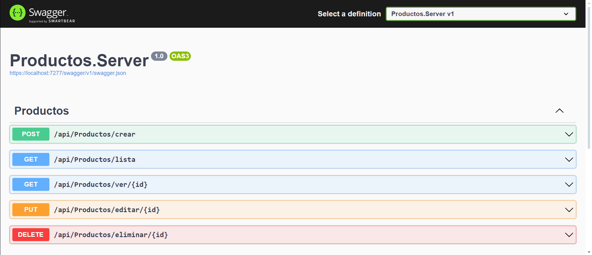
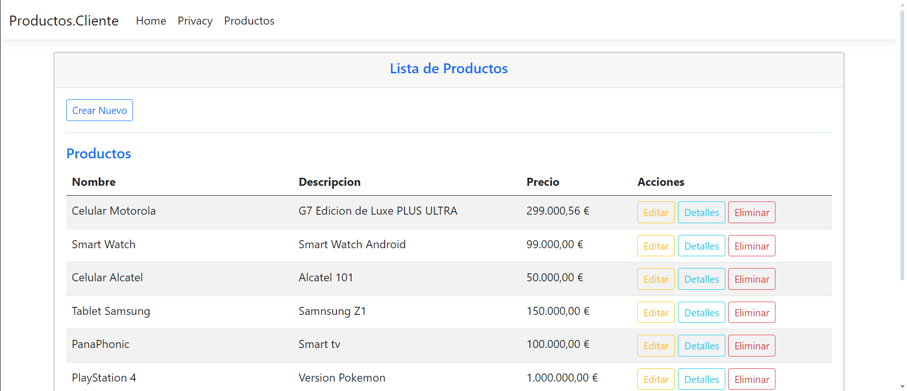
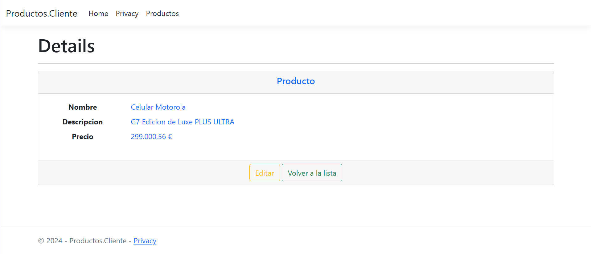

## Consumo de API REST

Este proyecto es una API REST desarrollada en C# para la gestión y administración de productos.
La API está diseñada para realizar operaciones completas de CRUD (Crear, Leer, Actualizar y Eliminar).

### Descripción del Proyecto
- **Backend:** La API está implementada utilizando ASP.NET Core Web API, proporcionando una solución robusta y escalable para la gestión de datos.
- **Base de Datos:** Se emplea Entity Framework Core con el enfoque Code First para la estructuración y manejo de datos.
- **Motor de Base de Datos:** Microsoft SQL Server.
- **Frontend:** La API es accesible a través de una interfaz sencilla desarrollada con ASP.NET Core MVC y estilizada con Bootstrap para una experiencia de usuario amigable.

### Tecnologías utilizadas:
 1. Swagger
 2. .NET 7
 3.  Microsoft SQL Server
 4. Entity Framework Core
 5. ASP.NET Core Web API
 6. ASP.NET Core MVC
 7. Bootstrap

### Imágenes:

